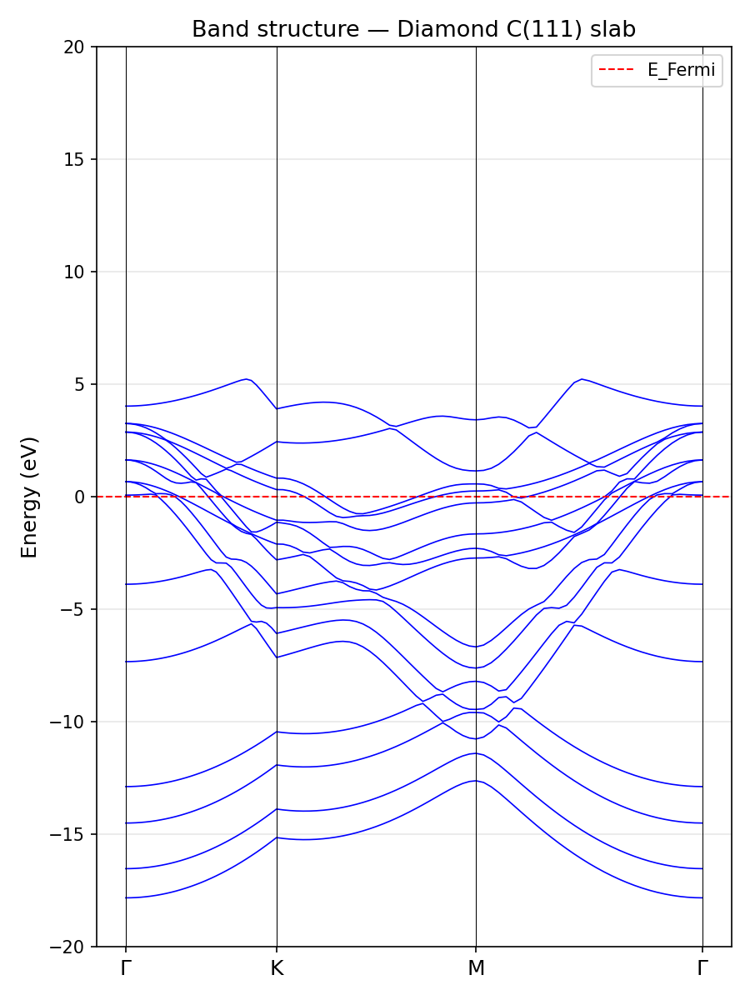

# DFT Study of Fluorine Adsorption on Diamond C(111) Surface

A minimal DFT workflow using Quantum ESPRESSO to study F adsorption on diamond,
directly relevant to WP2 of the CADENA project (surface functionalization of diamond).

## Scientific context

Diamond surfaces are promising substrates for electrochemical and biosensing
applications. Surface termination (H, F, O) critically controls the electronic
properties and reactivity of the surface. This work computes the adsorption
energy of a fluorine atom on the C(111) surface using DFT-PBE.

## Workflow

1. Geometry optimization of C(111) slab (8 atoms, 4 layers)
2. Relaxation of F atom adsorbed on top site
3. SCF calculation of isolated F atom (reference energy)
4. Adsorption energy: E_ads = E(slab+F) - E(slab) - E(F)

## Results

| System        | Total energy (Ry)   |
|---------------|---------------------|
| C(111) slab   | -147.32904          |
| Slab + F      | -206.68030          |
| F atom        |  -59.07783          |

**E_ads = -0.273 Ry = -3.720 eV**

The large negative value confirms strong, spontaneous chemisorption of F on
the diamond surface, consistent with the known strength of the C-F bond.
This is directly relevant to fluorine-terminated diamond electrodes studied
in CADENA WP2.

## Results visualization



Surface states visible near E_Fermi on the bare C(111) slab.
F adsorption (E_ads = -3.720 eV) passivates these states.

## Files

| File                    | Description                         |
|-------------------------|-------------------------------------|
| `diamond_slab.in`       | QE input — slab geometry relaxation |
| `adsorption_F.in`       | QE input — F adsorption relaxation  |
| `F_atom.in`             | QE input — isolated F atom SCF      |
| `bands_scf.in`          | QE input — SCF for band structure   |
| `bands_calc.in`         | QE input — band structure k-path    |
| `analyse_adsorption.py` | Python — E_ads calculation          |
| `plot_bands.py`         | Python — band structure plot        |
| `diamond_slab.cif`      | Crystal structure — slab only       |
| `adsorption_F.cif`      | Crystal structure — slab + F        |
| `band_structure.png`    | Band structure figure               |

## Software & parameters

- **Quantum ESPRESSO** v7.3
- **XC functional**: PBE (GGA)
- **Pseudopotentials**: ONCV norm-conserving, from QE library
- **Plane-wave cutoff**: 40 Ry (wfc), 160 Ry (rho)
- **k-point mesh**: 4x4x1 Monkhorst-Pack (8x8x1 for bands SCF)
- **Geometry relaxation**: BFGS

## How to reproduce

```bash
# 1. Optimize slab
pw.x < diamond_slab.in > diamond_slab.out

# 2. Compute adsorption
pw.x < adsorption_F.in > adsorption_F.out

# 3. Reference atom
pw.x < F_atom.in > F_atom.out

# 4. Band structure
pw.x < bands_scf.in > bands_scf.out
pw.x < bands_calc.in > bands_calc.out
bands.x < bands_pp.in > bands_pp.out

# 5. Analysis
python3 analyse_adsorption.py
python3 plot_bands.py
```

## Author

Rania Zaier 2026
