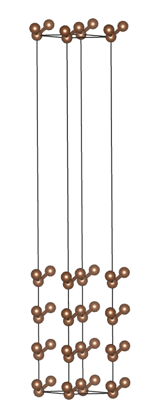
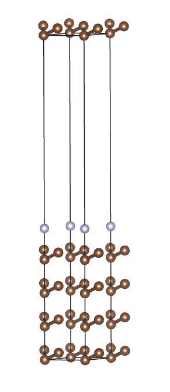
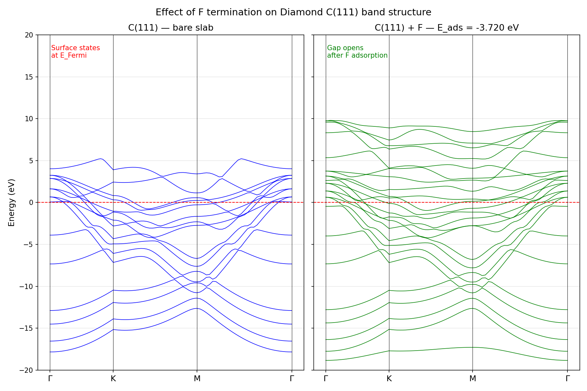

cat > ~/diamond_project/README.md << 'EOF'
# DFT Study of Fluorine Adsorption on Diamond C(111) Surface

A minimal DFT workflow using Quantum ESPRESSO to study F adsorption on diamond.

## Scientific context

Diamond surfaces are promising substrates for electrochemical and biosensing
applications. Surface termination (H, F, O) critically controls the electronic
properties and reactivity of the surface. This work computes the adsorption
energy of a fluorine atom on the C(111) surface using DFT-PBE, and shows the
effect of F termination on the electronic band structure.

## Workflow

1. Geometry optimization of C(111) slab (8 atoms, 4 layers)
2. Relaxation of F atom adsorbed on top site
3. SCF calculation of isolated F atom (reference energy)
4. Adsorption energy: E_ads = E(slab+F) - E(slab) - E(F)
5. Band structure of bare slab and F-terminated slab

## Results

| System        | Total energy (Ry)   |
|---------------|---------------------|
| C(111) slab   | -147.32904          |
| Slab + F      | -206.68030          |
| F atom        |  -59.07783          |

**E_ads = -0.273 Ry = -3.720 eV**

The large negative value confirms strong, spontaneous chemisorption of F on
the diamond surface, consistent with the known strength of the C-F bond.

## Crystal structures (VESTA)

| Bare C(111) slab | C(111) + F |
|:-:|:-:|
|  |  |

## Electronic structure



The bare C(111) slab shows metallic surface states crossing E_Fermi (dangling bonds).
After F adsorption (E_ads = -3.720 eV), these surface states are passivated —
the C-F bond saturates the dangling bonds and opens a gap at the surface.
This electronic effect is central to the electrochemical properties of
fluorinated diamond electrodes.


## Files

| File                      | Description                          |
|---------------------------|--------------------------------------|
| `diamond_slab.in`         | QE input — slab geometry relaxation  |
| `adsorption_F.in`         | QE input — F adsorption relaxation   |
| `F_atom.in`               | QE input — isolated F atom SCF       |
| `bands_scf.in`            | QE input — SCF for band structure    |
| `bands_calc.in`           | QE input — band structure k-path     |
| `bands_F_scf.in`          | QE input — SCF slab+F band structure |
| `bands_F_calc.in`         | QE input — slab+F band k-path        |
| `analyse_adsorption.py`   | Python — E_ads calculation           |
| `plot_bands.py`           | Python — band structure plot         |
| `plot_bands_comparison.py`| Python — bare vs F-terminated plot   |
| `run_all.sh`              | Shell — runs the full workflow       |
| `diamond_slab.cif`        | Crystal structure — slab only        |
| `adsorption_F.cif`        | Crystal structure — slab + F         |
| `band_structure.png`      | Band structure — bare slab           |
| `bands_comparison.png`    | Band structure — bare vs F           |
| `structure_bare.png`      | VESTA view — bare slab               |
| `structure_F.png`         | VESTA view — slab + F                |

## Software & parameters

- **Quantum ESPRESSO** v7.3
- **XC functional**: PBE (GGA)
- **Pseudopotentials**: ONCV norm-conserving, from QE library
- **Plane-wave cutoff**: 40 Ry (wfc), 160 Ry (rho)
- **k-point mesh**: 4x4x1 Monkhorst-Pack (8x8x1 for band structure SCF)
- **Geometry relaxation**: BFGS algorithm

## How to reproduce

One command runs the full workflow:

```bash
bash run_all.sh
```

Or step by step:

```bash
# 1. Optimize slab
~/q-e/bin/pw.x < diamond_slab.in > diamond_slab.out

# 2. Compute adsorption
~/q-e/bin/pw.x < adsorption_F.in > adsorption_F.out

# 3. Reference atom
~/q-e/bin/pw.x < F_atom.in > F_atom.out

# 4. Adsorption energy
python3 analyse_adsorption.py

# 5. Band structure — bare slab
~/q-e/bin/pw.x < bands_scf.in > bands_scf.out
~/q-e/bin/pw.x < bands_calc.in > bands_calc.out
~/q-e/bin/bands.x < bands_pp.in > bands_pp.out
python3 plot_bands.py

# 6. Band structure — slab + F
~/q-e/bin/pw.x < bands_F_scf.in > bands_F_scf.out
~/q-e/bin/pw.x < bands_F_calc.in > bands_F_calc.out
~/q-e/bin/bands.x < bands_F_pp.in > bands_F_pp.out

# 7. Comparison plot
python3 plot_bands_comparison.py
```

## Author

Rania Zaier — May 2026
EOF
